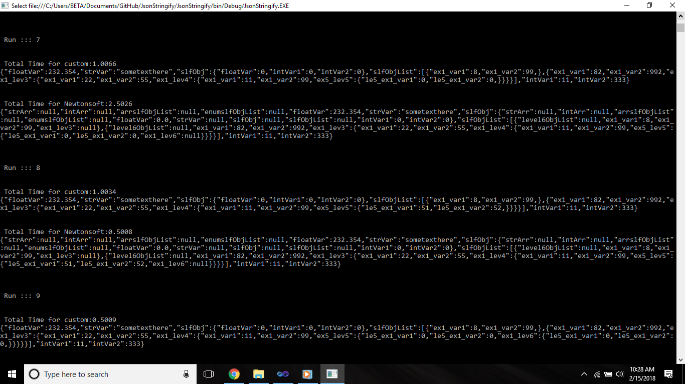

# JsonStringify

<b>Object to Json Stringify</b>

<b>What is this repo all about?</b> 
  You can use it to convert the object to json string.  
  
<b>Any limitation here?</b> 
 No self recursion is allowed here. As of now, List is supported as part of this. Will add more here.  
 
<b>Any samples here?</b> 
 Yes. Lets take this one. 
 
<pre>
  Ex exObj = new Ex()
            {
                floatVar = 232.354F,
                strVar = "sometexthere",
                slfObj = new Ex(),
                intVar1 = 11,
                intVar2 = 333,
                slfObjList = new List<EX1>() 
                { 
                    new EX1() { ex1_var1 = 8, ex1_var2 = 99 }, 
                    new EX1() { ex1_var1 = 82, ex1_var2 = 992, ex1_lev3 = new Level3()
                    {
                        ex1_lev4 = new Level4()
                        {
                             ex1_var1 =11, 
                             ex1_var2 = 99
                        },
                        ex1_var1 = 22,
                        ex1_var2 =55
                    } 
                }
                }
            };

</pre>

<b>This is producing the Json string as:-</b> 

<pre>
{
   "floatVar":232.354,
   "strVar":"haha",
   "slfObjList":[
      {
         "ex1_var1":8,
         "ex1_var2":99
      },
      {
         "ex1_var1":82,
         "ex1_var2":992,
         "ex1_lev3":{
            "ex1_var1":22,
            "ex1_var2":55,
            "ex1_lev4":{
               "ex1_var1":11,
               "ex1_var2":99
            }
         }
      }
   ],
   "intVar1":11,
   "intVar2":333
}
</pre>

<b>Another nested example with arrays of primitive and UDF class.</b>

<pre>
Ex exObj = new Ex()
                {
                    enumslfObjList = new List<EX1>() { new EX1() { ex1_var1 = 9, ex1_var2 = 10 } },
                    strArr = new string[] { "a", "b" },
                    intArr = new int[] { 1, 2, 3, 4 },
                    arrslfObjList = new EX1[] 
                    { 
                    new EX1() 
                    { 
                        ex1_var1 = 1, ex1_var2 = 2, 
                        level6ObjList = new Level6[] 
                    { 
                        new Level6() { le5_ex1_var1 = 11, le5_ex1_var2 = 22 },
                        new Level6() { le5_ex1_var1 = 11, le5_ex1_var2 = 22, 
                            level7ObjList = new List<Level7>()
                            { 
                                new Level7() { le7_ex1_var1 = 71, le7_ex1_var2 = 72 } 
                            } 
                           } 
                    } 
                    } 
                    },
                    floatVar = 232.354F,
                    strVar = "sometexthere",
                    slfObj = new Ex(),
                };
</pre>

which will produce the json string as,

<pre>
{
   "strArr":[
      "a",
      "b"
   ],
   "intArr":[
      1,
      2,
      3,
      4
   ],
   "arrslfObjList":[
      {
         "level6ObjList":[
            {
               "le5_ex1_var1":11,
               "le5_ex1_var2":22
            },
            {
               "le5_ex1_var1":11,
               "le5_ex1_var2":22,
               "level7ObjList":[
                  {
                     "le7_ex1_var1":71,
                     "le7_ex1_var2":72
                  }
               ]
            }
         ],
         "ex1_var1":1,
         "ex1_var2":2
      }
   ],
   "enumslfObjList":[
      {
         "ex1_var1":9,
         "ex1_var2":10
      }
   ],
   "floatVar":232.354,
   "strVar":"sometexthere",
   "slfObj":{
      "floatVar":0,
      "intVar1":0,
      "intVar2":0
   },
   "intVar1":0,
   "intVar2":0
}
</pre>
<b>Sample Comparsion with Newtonsoft Dll conversion:-</b> 

Will add more here.

Thx for stopping by :)
